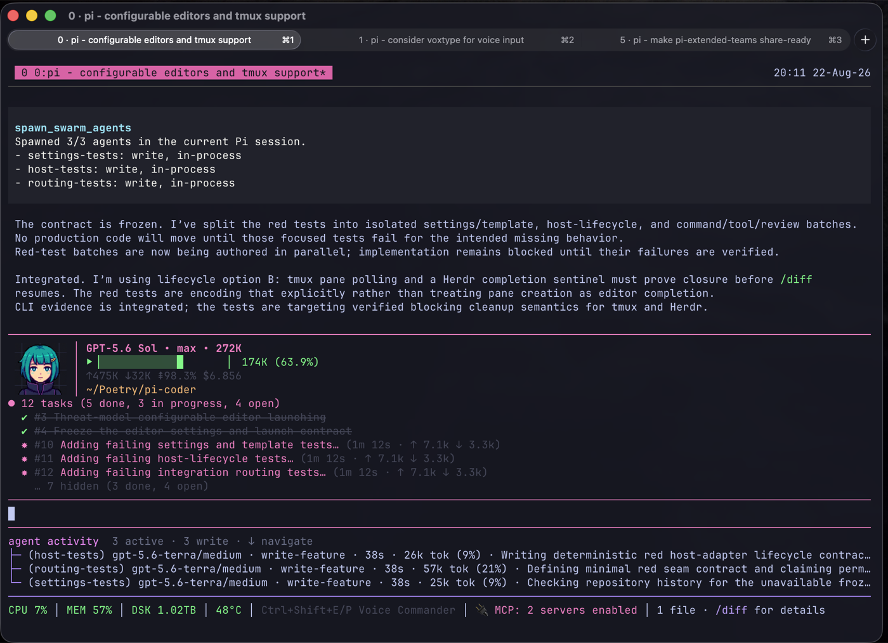
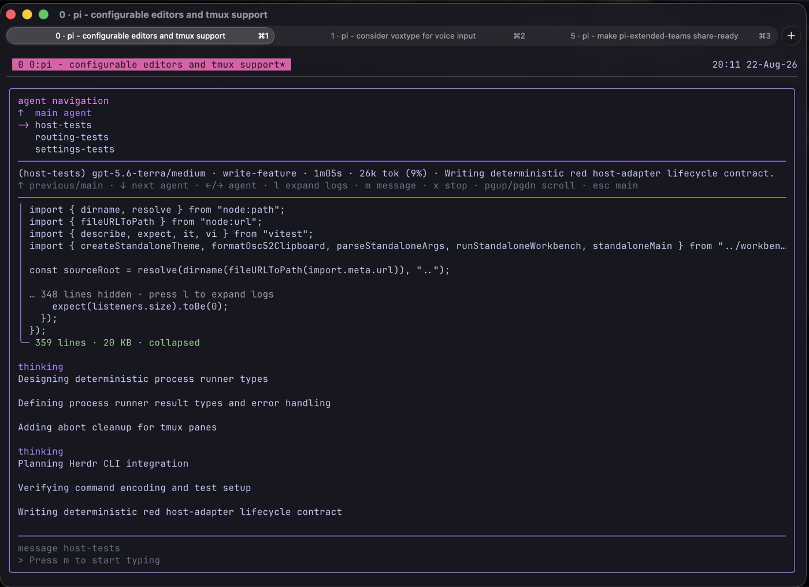

# pi-extended-teams

**A control-first subagent system for Pi.**

pi-extended-teams lets the lead split work into bounded lanes, watch agents live, steer or stop them, and receive their reports. The lead still makes the final call.

Read agents are the default. Edit agents are opt-in and should own isolated files.

[](assets/pi-extended-teams-in-action.png)

## Install and run

Install from GitHub:

```bash
pi install git:github.com/dantetekanem/pi-extended-teams
```

Run `/agents-favorite-models` once in Pi and choose a model and thinking level for each intent tier.

Then ask for help naturally:

```text
Review the current changes with separate agents for correctness, test gaps, and security. Give me the evidence so I can make the final call.
```

The current Pi session becomes the agent group automatically. There is no separate setup step.

## How it works

- Read and edit agents run in-process and stay connected to the current Pi session.
- The activity card shows progress, intent tier, elapsed time, tokens, and tool activity.
- You can open an agent's transcript, send it a message, or stop it.
- Completed reports return to the lead automatically and remain recoverable when needed.
- Every spawn uses a configured intent tier instead of ad hoc model settings.
- Edit agents can claim isolated files. Claims coordinate cooperative agents; they are not access control.
- Lazy session context and nested read helpers are available when a bounded task needs them.

This works well for multi-angle code review, root-cause investigation, parallel verification, repository mapping, and one narrow edit that can stay separate from the lead's work.

## Live control

With the editor empty, press Down to open agent navigation. Use Down/Up to move, `l` to expand large tool logs, `m` to message an agent, `x` to stop it, and Escape to return.

[](assets/pi-extended-teams-agent-navigation.png)

Completed reports wake the lead automatically. Do not poll with sleeps, loops, or repeated status checks. Use `check_teammate` only when one agent appears unhealthy or a persisted report needs recovery.

The lead owns decomposition, integration, and acceptance. Pi packages and spawned agents run with your system permissions, so review project-local instructions and configuration through Pi's normal trust flow.

## Intent tiers

Every spawn uses a configured `model_slot`:

| Tier | Use it for |
| --- | --- |
| `read-collect` | Bounded facts, logs, inventories, or test output. |
| `read-review` | Normal review, verification, and test-gap work. |
| `read-analyze` | Root-cause analysis across connected evidence. |
| `read-critical` | Rare high-stakes security, architecture, concurrency, migration, or data reasoning. |
| `write-patch` | A narrow documentation, config, fixture, or bug fix. |
| `write-feature` | A bounded feature with a known design. |
| `write-system` | A cross-cutting integration or refactor inside claimed files. |
| `write-critical` | Rare high-risk security, concurrency, recovery, migration, or data-integrity work. |

`read-review` is the normal read default. Legacy tier names remain accepted for this minor release, but new prompts should use the canonical names above.

## Explicit spawning

Pi can choose when delegation helps, or you can call the tools directly:

```text
spawn_swarm_agents({
  defaults: { model_slot: "read-review" },
  agents: [
    { name: "correctness", prompt: "Review the diff for concrete correctness risks. Do not edit." },
    { name: "tests", prompt: "Find missing regression coverage with file and line evidence. Do not edit." }
  ]
})
```

For an edit, choose a write tier and name the files it may claim. Never run overlapping writers against the same paths.

## Configuration

Global settings live at `~/.pi/agent/pi-extended-teams/settings.json`. Project overrides live at `.pi/pi-extended-teams.json`. Favorite intent tiers are global so `/agents-favorite-models` and spawning use the same choices.

Spawned sessions are private by default under `~/.pi/teams/<team>/agent-sessions/` and stay out of Pi's normal `/resume` picker.

## Development

```bash
pnpm typecheck
pnpm test:focused
```

## Credits

pi-extended-teams is based on [pi-teams](https://github.com/burggraf/pi-teams). This fork focuses on session-connected agents, live control, and a smaller public tool surface.

The broader coordination lineage includes [claude-code-teams-mcp](https://github.com/cs50victor/claude-code-teams-mcp).

## License

MIT
