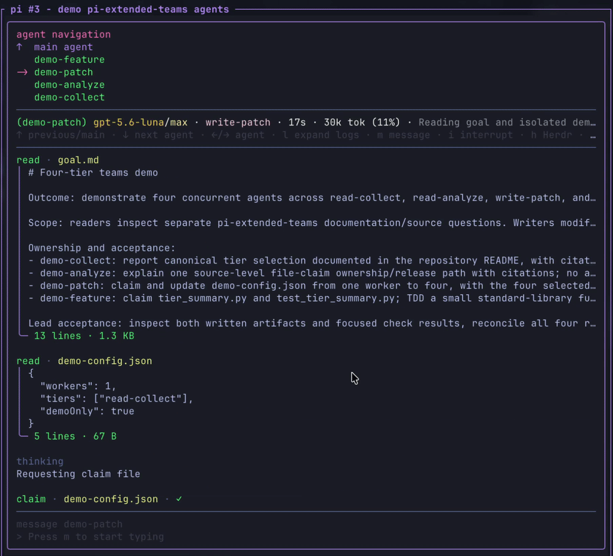

# pi-extended-teams

pi-extended-teams runs read and write agents inside Pi, with eight configurable tiers and a live view of their work. Agents have separate conversations, can message each other, and return their results to your current session.

[](assets/pi-extended-teams-demo.gif)

## Features

- Run readers and writers in parallel. One agent can trace a failure while another checks tests or works on a separate change. File claims help writers coordinate their edits.

- Choose models by the work they will do. Eight tiers cover collection, review, analysis, critical reasoning, patches, features, system changes, and critical implementation. Each tier has its own model and thinking setting, with the lead's settings as the fallback.

- Let a writer call in specialists. A `write-feature` or `write-critical` agent can spawn read helpers when explicitly enabled. Helpers report to that writer and cannot delegate further.

- Direct agent-to-agent messaging lets readers send findings straight to writers, without making the lead relay them.

- Follow each agent from the editor. The activity card shows progress, tier, model, elapsed time, and context usage. Down opens the transcript, with theme-aware panels, configurable colors, and expandable tool results.

- Mouse-wheel and Page Up/Page Down scrolling works inside Herdr, too. Press End to follow live output again.

- Move an agent into its own Herdr pane with `h`. Eligible direct agents resume their saved conversation in a focused sibling pane and keep communicating with the team.

- Correct an agent while it works. Press `m` to message it, `i` to interrupt its current command while keeping its context, or `x` to stop it.

- Keep running agents through same-process `/reload`. Their controls and reports reconnect after the reload; process restarts are not supported.

- Choose which of your loaded Pi extensions agents can use. Onboarding recommends models and extension settings for approval.

- Check the work before accepting it. Assign verification commands, record which source they checked, and optionally allow a limited number of repair attempts. Reports distinguish the agent's claimed outcome from check results.

- Keep the findings after agents exit. Reports arrive automatically, can be grouped into a batch summary, and remain recoverable. Save specialist findings for a fresh follow-up; compatible footers can show combined recorded session costs.

## Get started

Try it for one Pi session:

```bash
pi -e npm:pi-extended-teams
```

Or install it:

```bash
pi install npm:pi-extended-teams
```

GitHub installation is also supported: `pi install git:github.com/dantetekanem/pi-extended-teams`.

Run `/pi-extended-teams-onboard` for setup recommendations, then ask for what you need:

> Use separate agents to investigate the failure and check the test coverage. Bring their findings back together.

## Documentation

[Agent reference](docs/reference.md) covers tiers, keyboard controls, Herdr eligibility, configuration, checks, repair, checkpoints, and extension integration. [The teams skill](skills/teams.md) has orchestration and handoff examples. See [the changelog](CHANGELOG.md) for release history.

Agents run with your system permissions. Read-only roles and file claims are coordination contracts, not sandboxes. See [access disclosures](docs/access.md) and [security reporting](SECURITY.md).

## Development

```bash
pnpm typecheck
pnpm test:focused
```

## Credits and license

Based on [pi-teams](https://github.com/burggraf/pi-teams), with coordination lineage from [claude-code-teams-mcp](https://github.com/cs50victor/claude-code-teams-mcp).

[MIT](LICENSE).
